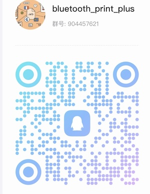

## Introduction

BluetoothPrint is a bluetooth plugin for [Flutter](https://flutter.dev), a new mobile SDK to help developers build bluetooth thermal printer apps for both iOS and Android.(for example, Gprinter pt-280、pt-380、gp-1324、gp-2120 eg.)

### verison
1.0.0 -> blue and tsc command

## Features

|                         |      Android       |         iOS          |             Description            |
| :---------------        | :----------------: | :------------------: |  :-------------------------------- |
| scan                    | :white_check_mark: |  :white_check_mark:  | Starts a scan for Bluetooth Low Energy devices. |
| connect                 | :white_check_mark: |  :white_check_mark:  | Establishes a connection to the device. |
| disconnect              | :white_check_mark: |  :white_check_mark:  | Cancels an active or pending connection to the device. |
| state                   | :white_check_mark: |  :white_check_mark:  | Stream of state changes for the Bluetooth Device. |


## Tsc Command

|          |      Android       |        iOS         | Description                                                  |
| :------- | :----------------: | :----------------: | :----------------------------------------------------------- |
| size     | :white_check_mark: | :white_check_mark: | Set label size in millimeters                                |
| selfTest | :white_check_mark: | :white_check_mark: | Print self inspection page information                       |
| print    | :white_check_mark: | :white_check_mark: | Print out data stored in the buffer                          |
| gap      | :white_check_mark: | :white_check_mark: | Define the vertical spacing distance between two label papers. |
| speed    | :white_check_mark: | :white_check_mark: | Set printing speed                                           |
| density  | :white_check_mark: | :white_check_mark: | Set printing concentration                                   |
| cls      | :white_check_mark: | :white_check_mark: | Clear data from image buffer                                 |
| text     | :white_check_mark: | :white_check_mark: | print string                                                 |
| image    | :white_check_mark: | :white_check_mark: | print image                                                  |
| barCode  | :white_check_mark: | :white_check_mark: | This instruction is used to draw one-dimensional barcodes    |
| qrCode   | :white_check_mark: | :white_check_mark: | This instruction is used to print QR codes                   |
| bar      | :white_check_mark: | :white_check_mark: | This instruction is used to draw lines on labels             |
| box      | :white_check_mark: | :white_check_mark: | This instruction is used to draw a rectangular box on a label |


## Usage

[Example](https://github.com/)

### To use this plugin :

- add the dependency to your [pubspec.yaml](https://github.com/thon-ju/bluetooth_print/blob/master/example/pubspec.yaml) file.

```yaml
  dependencies:
    flutter:
      sdk: flutter
    bluetooth_print_plus:
```

### Add permissions for Bluetooth
We need to add the permission to use Bluetooth and access location:

#### **Android**
In the **android/app/src/main/AndroidManifest.xml** let’s add:

```xml 
	 <uses-permission android:name="android.permission.BLUETOOTH" />  
	 <uses-permission android:name="android.permission.BLUETOOTH_SCAN" />
     <uses-permission android:name="android.permission.BLUETOOTH_CONNECT" />
	 <uses-permission android:name="android.permission.BLUETOOTH_ADMIN" />  
	 <uses-permission android:name="android.permission.ACCESS_COARSE_LOCATION"/>  
 <application
```
#### **IOS**
In the **ios/Runner/Info.plist** let’s add:

```dart 
	<dict>  
	    <key>NSBluetoothAlwaysUsageDescription</key>  
	    <string>Need BLE permission</string>  
	    <key>NSBluetoothPeripheralUsageDescription</key>  
	    <string>Need BLE permission</string>  
	    <key>NSLocationAlwaysAndWhenInUseUsageDescription</key>  
	    <string>Need Location permission</string>  
	    <key>NSLocationAlwaysUsageDescription</key>  
	    <string>Need Location permission</string>  
	    <key>NSLocationWhenInUseUsageDescription</key>  
	    <string>Need Location permission</string>
```

For location permissions on iOS see more at: [https://developer.apple.com/documentation/corelocation/requesting_authorization_for_location_services](https://developer.apple.com/documentation/corelocation/requesting_authorization_for_location_services)

### init a BluetoothPrint instance

```dart
import 'package:bluetooth_print_plus/bluetooth_print_plus.dart';
import 'package:bluetooth_print/bluetooth_print_model.dart';


final _bluetoothPrintPlus = BluetoothPrintPlus.instance;
```

### scan
```dart
// begin scan
_bluetoothPrintPlus.startScan(timeout: const Duration(seconds: 30));

// get devices
StreamBuilder<List<BluetoothDevice>>(
  stream: _bluetoothPrintPlus.scanResults,
  initialData: [],
  builder: (c, snapshot) => ListView(
    children: snapshot.data!.map((d) => Container(
      padding: const EdgeInsets.only(left: 10, right: 10, bottom: 5),
      child: Row(
            mainAxisAlignment: MainAxisAlignment.spaceBetween,
            children: [
              Expanded(
                  child: Column(
                    crossAxisAlignment: CrossAxisAlignment.start,
                    children: [
                      Text(d.name ?? ''),
                      Text(
                        d.address ?? 'null',
                        overflow: TextOverflow.ellipsis,
                        style: const TextStyle(
                            fontSize: 12,
                            color: Colors.grey
                        ),
                      ),
                      const Divider(),
                    ],
                  )
              ),
              const SizedBox(width: 10,),
              ElevatedButton(
                  onPressed: () async {
                      _bluetoothPrintPlus.stopScan();
                      _bluetoothPrintPlus.connect(d);
                      _device = d;
                  },
                  child: const Text("connect"),
              )
            ],
          ),
    )).toList(),
  ),
)
```

### connect
```dart
await _bluetoothPrintPlus.connect(_device);
```

### disconnect
```dart
await _bluetoothPrintPlus.disconnect();
or
await  BluetoothPrintPlus.instance.disconnect();
```

### listen state
```dart
_bluetoothPrintPlus.state.listen((state) {
  print('cur device status: $state');
  switch (state) {
    case BluetoothPrint.CONNECTED:
      setState(() {
        _connected = true;
      });
      break;
    case BluetoothPrint.DISCONNECTED:
      setState(() {
        _connected = false;
      });
      break;
    default:
      break;
  }
});
```
### print (tsc command, label mode)
```dart
    final ByteData bytes = await rootBundle.load("assets/dithered-image.png");
    final Uint8List image = bytes.buffer.asUint8List();
    await tscCommand.cleanCommand();
    await tscCommand.cls();
    await tscCommand.size(width: 76, height: 130);
    await tscCommand.image(image: image, x: 50, y: 60);
    await tscCommand.print(1);
    final cmd = await tscCommand.getCommand();
    if (cmd == null) return;
    BluetoothPrintPlus.instance.write(cmd);
```


## Troubleshooting
#### error:'State restoration of CBCentralManager is only allowed for applications that have specified the "bluetooth-central" background mode'    
info.plist add:
```
<key>NSBluetoothAlwaysUsageDescription</key>
<string>Allow App use bluetooth?</string>
<key>NSBluetoothPeripheralUsageDescription</key>
<string>Allow App use bluetooth?</string>
<key>UIBackgroundModes</key>
<array>
    <string>bluetooth-central</string>
    <string>bluetooth-peripheral</string>
</array>
```

## FAQ Support 
you can join this [QQ](https://im.qq.com/index.shtml) group or join [TG group](https://t.me/+a7KAkNjHFS81MGNi),  feedback your problem 



## Buy me a coffee


## Thanks For
- [flutter_blue](https://github.com/pauldemarco/flutter_blue)
